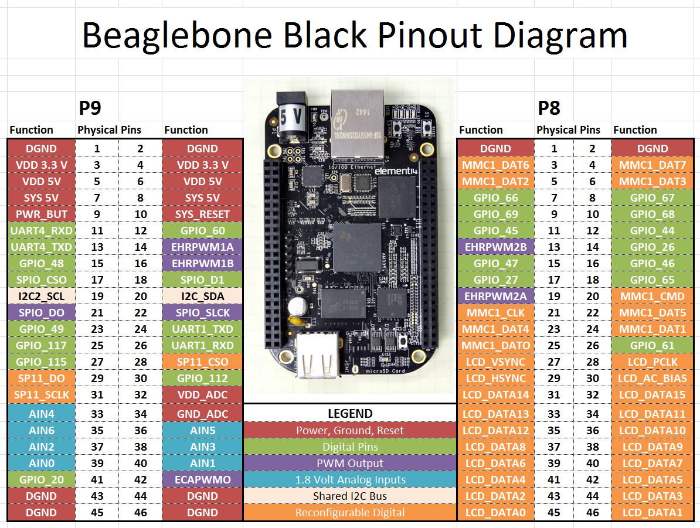
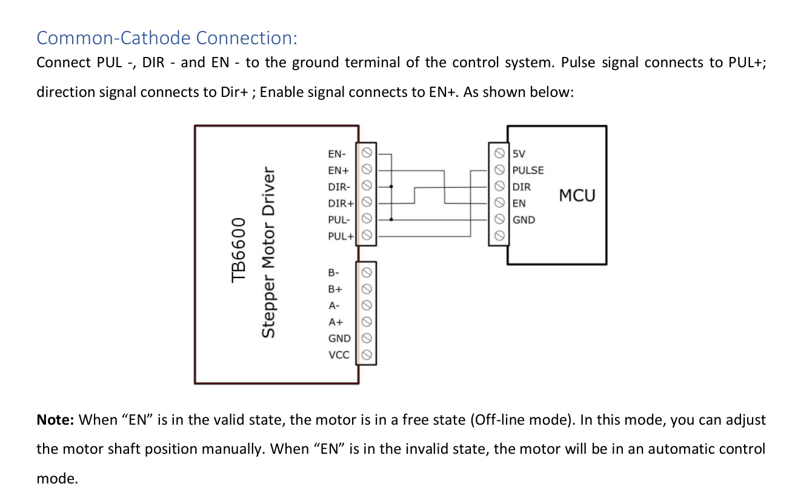

# BeagleBone Black GPIO Software Driver for controlling the TB6600 Stepper Motor Hardware Driver

This software driver implements the control of a NEMA-type stepper motor by means of a TB6600 hardware driver using the GPIO of a BeagleBone Black single-board computer.
It is possible to control such parameters of the stepper motor as:

- Acceleration
- Speed
- Position

## Hardware description

The figure below shows the GPIO diagram of the BeagleBone Black single-board computer.


## How to connect BeagleBone Black and TB6600

To test the software driver, only a circuit with a common cathode was used, as shown in the figure below. For more information about TBB6600, follow the link [TBB6600](doc/drayver-TB6600-manual.pdf)



## Installation

```bash
cd ${PROJECT_DIR}/build
cmake .. -DBUILD_STEPPER_DRIVER_LIB_EXAMPLES=ON
make
```

## How to use

The library has [StepperDriverTB6600](include/bbb_stepper/stepper_driver_tb6600.hpp) class that provides several methods to control a NEMA-type stepper motor via TB6600 hardware driver.

To setup the control interface call next methods below:

```cpp
  auto stepper = StepperDriverTB6600(dir_pin, pul_pin, ena_pin);
  stepper.init();
  stepper.setCurrentPosition(0);
  stepper.setMaxSpeed(speed);
  stepper.setAcceleration(accel);
  stepper.runToNewPosition(position);
```

where, `init()` - is driver initialization method(should be run before every other methods and only once), `setCurrentPosition()` - is method for setting current motor position in steps, `setMaxSpeed()` - is a method for setting maximum motor speed limit in steps, `setAcceleration()` - for seting motor acceleration in steps, `runToNewPosition()` - moves the motor to the new target position and blocks until it is at position
Here an [example](examples/TB6600/main.cpp) to learn more.

```bash
sudo ${PROJECT_DIR}/build/examples/TB6600/stepper_driver_lib_TB6600 --help
TB6600 Stepper driver options:
  -h [ --help ]         Show help
  --ena_pin arg         Enable pin of TB6600 Stepper driver. Default: 'P8.8'
  --dir_pin arg         Direction pin of TB6600 Stepper driver. Default: 
                        'P8.10'
  --pul_pin arg         Pulse pin of TB6600 Stepper driver. Default: 'P8.12'
  --max_speed arg       Max stepper motor speed in steps. Default: 600
  --accel arg           Stepper motor acceleration in steps. Default: 300
  --target_pos arg      Stepper motor target position in steps. Default: 2000
```
