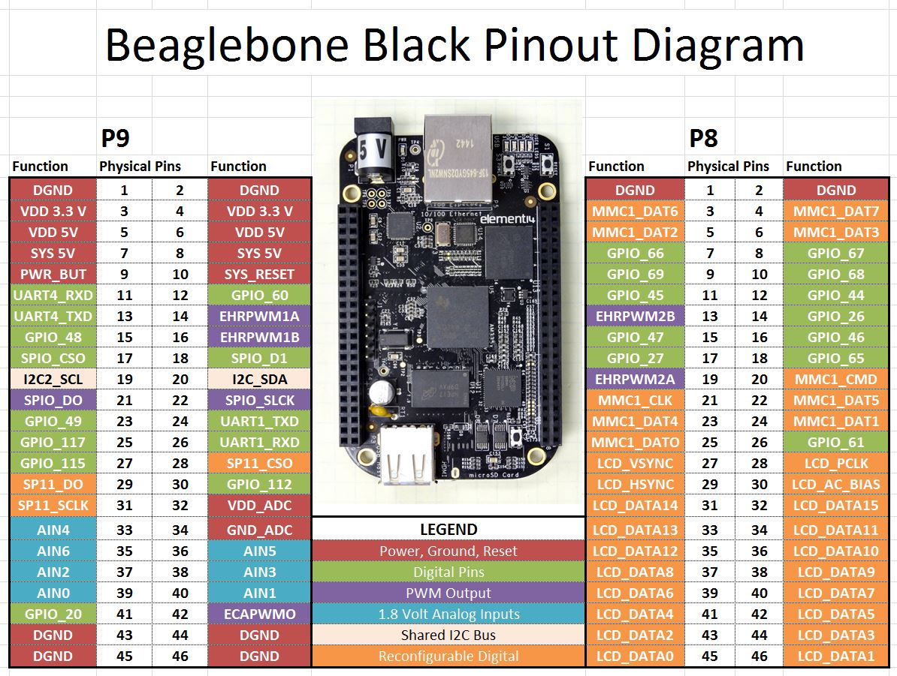

# Программный драйвер BeagleBone Black GPIO для управления аппаратным драйвером TB6600 для шаговых двигателей

Данный программный драйвер реализует управление шаговым двигателем типа NEMA посредством аппаратного драйвера TB6600 с помощью GPIO одноплатного компьютера BeagleBone Black.
Есть возможность управлять такими параметрами шагового двигателя как:

- Ускорение
- Скорость
- Позиция

## Описание оборудования

На рисунке ниже представлена схема GPIO одноплатного компьютера BeagleBone Black.

### Как подключить контроллер BeagleBone Black к TB6600

Для тестирования программного драйвера использовалась только схема с общим катодом как показано на рисунке ниже. Более подробно о TBB6600 по ссылке [TBB6600](doc/drayver-TB6600-manual.pdf)

